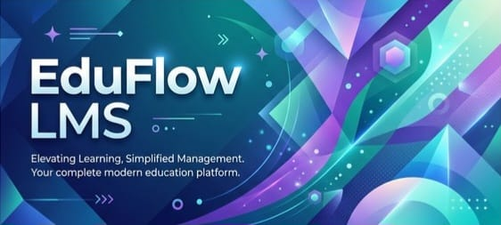
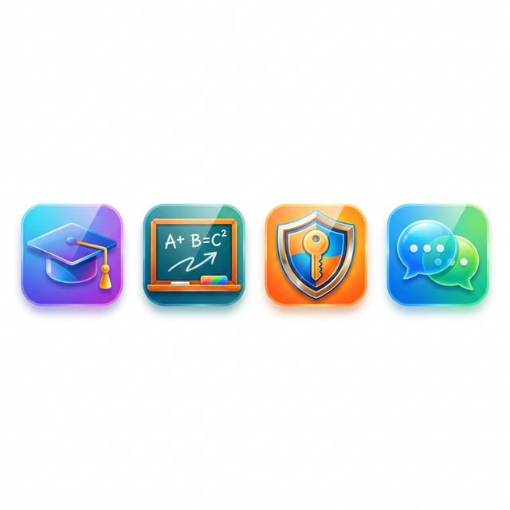

<div align="center">



# 🎓 EduFlow Learning Management System

[](https://spring.io/projects/spring-boot)
[](https://www.oracle.com/java/)
[](https://spring.io/projects/spring-ai)
[](http://www.h2database.com/)

---

**EduFlow** is a modern, full-featured Learning Management System designed to bridge the gap between students, teachers, and administrators. Built with security, scalability, and ease of use in mind.

[Explore Features](#🚀-key-features) • [Getting Started](#🛠️-getting-started) • [Tech Stack](#💻-technology-stack)

</div>

## 🚀 Key Features



### 👨‍💼 Admin Dashboard
*   **Role Management**: Full control over user accounts and permissions.
*   **Academic Structure**: Effortlessly manage grades, subjects, and teacher assignments.
*   **Announcements**: Broadcast important updates to the entire institution or specific groups.

### 👩‍🏫 Teacher Portal
*   **Course Control**: Create and manage curriculum with a robust sets of tools.
*   **Student Tracking**: Monitor individual progress and academic performance.
*   **Resource Library**: Upload and share learning materials (PDF support included).

### 🧑‍🎓 Student Experience
*   **Personalized Learning**: View enrolled subjects and track your own academic journey.
*   **Assignment Management**: Stay on top of deadlines and submit work through the portal.
*   **Progress Insights**: Real-time feedback on performance and achievements.

### 💬 Communication Hub
*   **Real-time Messaging**: Direct communication between teachers and students.
*   **Instant Notifications**: Never miss a deadline or an announcement with our built-in notification system.

---

## 💻 Technology Stack

<details>
<summary><b>Backend & Infrastructure</b></summary>

- **Spring Boot 4.0.3**: Reactive and high-performance base.
- **Spring AI**: Powering intelligent PDF document analysis.
- **Spring Data JPA**: Seamless data persistence and abstraction.
- **Spring Security**: Robust authentication and role-based access control.
- **H2 / MySQL**: Flexible database support for development and production.
</details>

<details>
<summary><b>Frontend & UI</b></summary>

- **Thymeleaf**: Server-side template engine for dynamic web pages.
- **Lombok**: Reducing boilerplate for cleaner, more maintainable code.
- **Validation**: Strict input validation using Hibernate Validator.
</details>

---

## 🛠️ Getting Started

### Prerequisites
- Java 17 or higher
- Maven (optional, wrapper included)

### Running the Project
1. Clone the repository.
2. Open the project folder in your terminal.
3. Run the following command:
   ```bash
   "./Start maven.cmd"
   ```
4. Access the application at `http://localhost:8080`.

---

## 📂 Project Structure

```text
src/main/java/com/lms/lms/
├── controller/    # Web controllers (Admin, Student, Teacher, etc.)
├── model/         # Data entities and DTOs
├── repository/    # Data access layer
├── service/       # Business logic
└── config/        # Security and App configuration
```

<div align="center">

Made with ❤️ for modern education.

</div>
